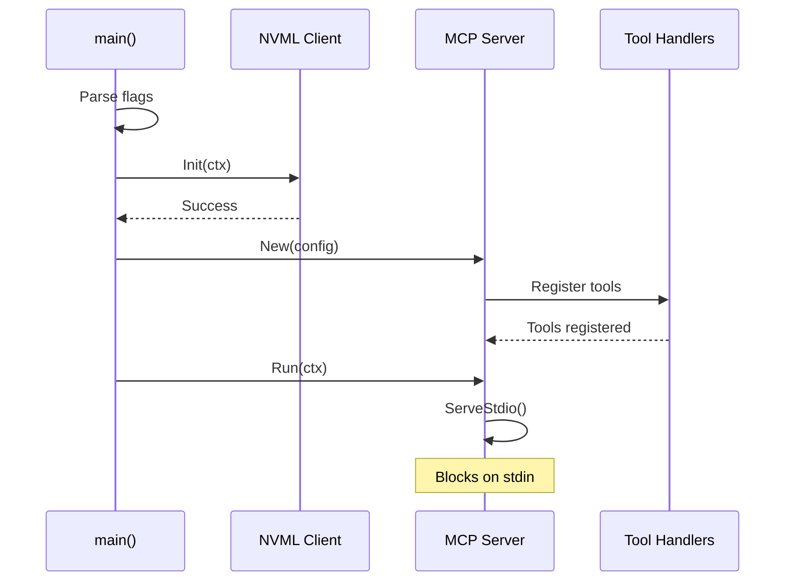
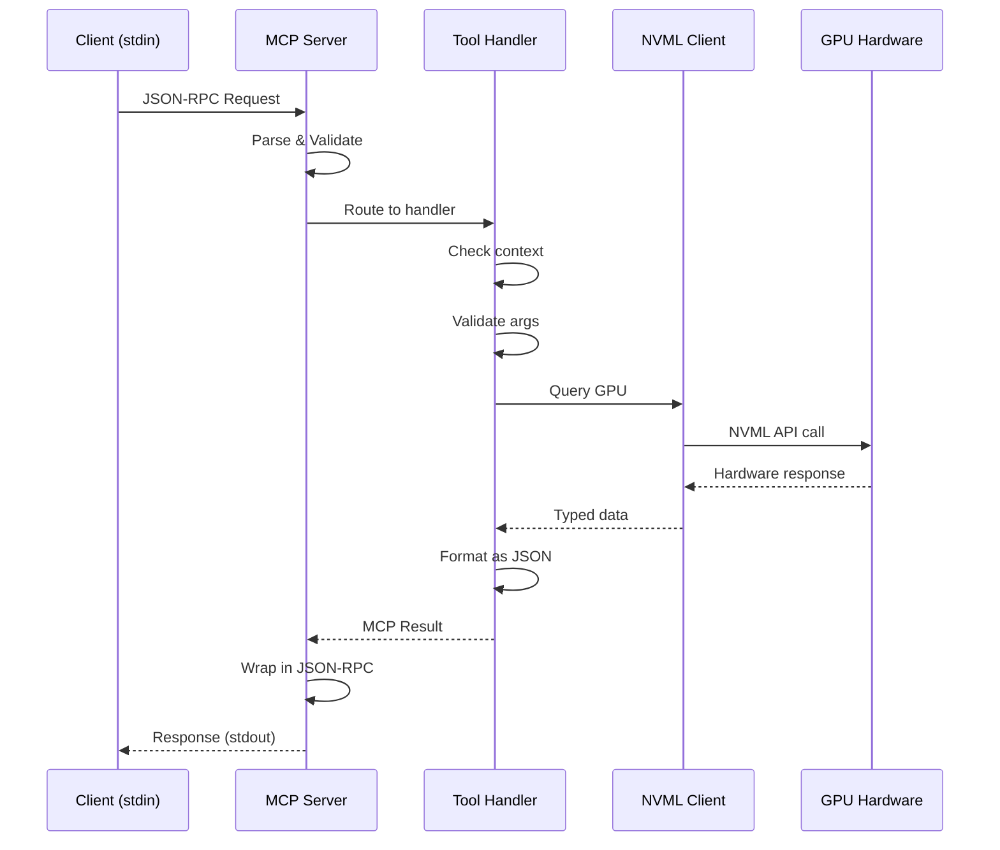

# Architecture

This document describes the architecture, design decisions, and technical
implementation of `k8s-mcp-agent`.

## Table of Contents

- [Overview](#overview)
- [Design Principles](#design-principles)
- [System Architecture](#system-architecture)
- [Component Design](#component-design)
- [Data Flow](#data-flow)
- [Security Model](#security-model)
- [Performance Considerations](#performance-considerations)

## Overview

`k8s-mcp-agent` is an **ephemeral diagnostic agent** that provides real-time
NVIDIA GPU hardware introspection for Kubernetes clusters via the Model
Context Protocol (MCP).

### Key Characteristics

- **Ephemeral**: No standing infrastructure, injected on-demand
- **Stdio Transport**: JSON-RPC 2.0 over standard I/O
- **AI-Native**: Designed for AI assistant consumption (Claude, Cursor)
- **Hardware-Focused**: Direct NVML access for deep GPU diagnostics
- **Kubernetes-Aware**: Integrates via `kubectl debug`

## Design Principles

### 1. The "Syringe Pattern"

Unlike traditional monitoring (DaemonSets, exporters), we use **ephemeral
injection**:

```
Traditional:                    Ephemeral (This Project):
┌─────────────┐                ┌─────────────┐
│ DaemonSet   │                │  kubectl    │
│ (Always On) │                │   debug     │
└──────┬──────┘                └──────┬──────┘
       │                              │
       ▼                              ▼
┌─────────────┐                ┌─────────────┐
│   Metrics   │                │   Agent     │
│   Server    │                │  (JIT Pod)  │
│  :9090/tcp  │                │  (Stdio)    │
└─────────────┘                └─────────────┘
                                      │
                                      ▼
                                  [Exits]
```

**Benefits:**
- **Zero attack surface** when idle
- **No resource overhead** on cluster
- **No port exposure** or network listeners
- **Just-in-time** diagnostics when needed
- **Automatic cleanup** after use

### 2. Stdio-Only Transport

**Why Stdio?**

1. **Works through kubectl debug** SPDY tunneling
2. **No network configuration** required
3. **Firewall-friendly** (no listening ports)
4. **Simpler security model**
5. **Standard I/O redirection** compatible

**Trade-offs:**
- Cannot be used as standalone HTTP server (by design)
- Requires MCP-compatible client (Claude Desktop, Cursor)

### 3. Interface Abstraction

We abstract NVML behind a Go interface:

```go
type Interface interface {
    Init(ctx context.Context) error
    GetDeviceCount(ctx context.Context) (int, error)
    GetDeviceByIndex(ctx context.Context, idx int) (Device, error)
    // ...
}
```

**Benefits:**
- **Testable**: Mock implementation for CI/development
- **Flexible**: Can add other GPU vendors (AMD, Intel)
- **Safe**: Isolates CGO complexity
- **Portable**: Tests run on any platform

## System Architecture

### High-Level Architecture

```
┌──────────────────────────────────────────────────────────────┐
│                      AI Host (Claude Desktop)                 │
│  ┌────────────────────────────────────────────────────────┐  │
│  │  MCP Client                                            │  │
│  │  - Sends JSON-RPC 2.0 requests                         │  │
│  │  - Receives structured responses                       │  │
│  └────────────┬───────────────────────────────────────────┘  │
└───────────────┼──────────────────────────────────────────────┘
                │
                │ kubectl debug node/gpu-node-5
                │ (SPDY Stdio Tunnel)
                ▼
┌──────────────────────────────────────────────────────────────┐
│                    Kubernetes Node (GPU-enabled)              │
│                                                               │
│  ┌────────────────────────────────────────────────────────┐  │
│  │  Ephemeral Debug Pod                                   │  │
│  │  ┌──────────────────────────────────────────────────┐  │  │
│  │  │  k8s-mcp-agent (stdin/stdout)                    │  │  │
│  │  │                                                   │  │  │
│  │  │  ┌─────────────┐      ┌──────────────┐          │  │  │
│  │  │  │ MCP Server  │◄────►│ Tool Handlers│          │  │  │
│  │  │  │ (stdio)     │      │              │          │  │  │
│  │  │  └─────────────┘      └──────┬───────┘          │  │  │
│  │  │                              │                   │  │  │
│  │  │                              ▼                   │  │  │
│  │  │                       ┌──────────────┐          │  │  │
│  │  │                       │ NVML Client  │          │  │  │
│  │  │                       │ (Mock/Real)  │          │  │  │
│  │  │                       └──────┬───────┘          │  │  │
│  │  └──────────────────────────────┼──────────────────┘  │  │
│  └─────────────────────────────────┼─────────────────────┘  │
│                                    │                         │
│                                    ▼                         │
│                            ┌──────────────┐                  │
│                            │ libnvidia-ml │                  │
│                            │  (NVML API)  │                  │
│                            └──────┬───────┘                  │
│                                   │                          │
│                                   ▼                          │
│                          ┌──────────────────┐                │
│                          │  GPU Hardware    │                │
│                          │  (Tesla T4, A100)│                │
│                          └──────────────────┘                │
└──────────────────────────────────────────────────────────────┘
```

### Component Layers

```
┌─────────────────────────────────────────┐
│  CLI Layer (cmd/agent/main.go)          │
│  - Flag parsing                          │
│  - Lifecycle management                  │
│  - Signal handling                       │
└──────────────────┬──────────────────────┘
                   │
┌──────────────────▼──────────────────────┐
│  MCP Server Layer (pkg/mcp/)            │
│  - JSON-RPC 2.0 protocol                │
│  - Stdio transport                       │
│  - Tool registration                     │
│  - Request routing                       │
└──────────────────┬──────────────────────┘
                   │
┌──────────────────▼──────────────────────┐
│  Tool Layer (pkg/tools/)                │
│  - get_gpu_inventory                     │
│  - echo_test                             │
│  - [Future: analyze_xid, telemetry]     │
└──────────────────┬──────────────────────┘
                   │
┌──────────────────▼──────────────────────┐
│  NVML Abstraction (pkg/nvml/)           │
│  ┌─────────────┐    ┌─────────────┐    │
│  │    Mock     │    │    Real     │    │
│  │ (Testing)   │    │ (go-nvml)   │    │
│  └─────────────┘    └─────────────┘    │
└───────────────────────────────────────┘
```

## Component Design

### MCP Server (`pkg/mcp/`)

**Responsibilities:**
- Initialize MCP server with stdio transport
- Register tool handlers
- Parse JSON-RPC 2.0 requests
- Route to appropriate handlers
- Marshal responses
- Manage server lifecycle

**Key Implementation:**
```go
type Server struct {
    mcpServer  *server.MCPServer
    mode       string
    nvmlClient nvml.Interface
}

func (s *Server) Run(ctx context.Context) error {
    // Blocks on stdio, serves JSON-RPC requests
    return server.ServeStdio(s.mcpServer)
}
```

### NVML Abstraction (`pkg/nvml/`)

**Interface Design:**
```go
type Interface interface {
    Init(ctx context.Context) error
    Shutdown(ctx context.Context) error
    GetDeviceCount(ctx context.Context) (int, error)
    GetDeviceByIndex(ctx context.Context, idx int) (Device, error)
}

type Device interface {
    GetName(ctx context.Context) (string, error)
    GetUUID(ctx context.Context) (string, error)
    // ... more methods
}
```

**Implementations:**

1. **Mock** (`mock.go`)
   - Fake NVIDIA A100 GPUs
   - No CGO dependency
   - Fast, deterministic tests
   - Used in CI/CD

2. **Real** (`real.go`) - **Requires CGO**
   - Wraps `github.com/NVIDIA/go-nvml`
   - Requires NVIDIA driver
   - Production use

3. **Stub** (`real_stub.go`) - **Non-CGO Fallback**
   - Compiles without CGO
   - Returns helpful error messages
   - Used in non-GPU CI builds

### Tool Handlers (`pkg/tools/`)

Each tool follows a consistent pattern:

```go
type XYZHandler struct {
    nvmlClient nvml.Interface
}

func (h *XYZHandler) Handle(
    ctx context.Context,
    request mcp.CallToolRequest,
) (*mcp.CallToolResult, error) {
    // 1. Check context cancellation
    // 2. Extract arguments
    // 3. Call NVML
    // 4. Format response as JSON
    // 5. Return MCP result
}
```

## Data Flow

### 1. Agent Startup

```
main() 
  └─► Parse flags (--mode, --nvml-mode)
      └─► Initialize NVML (mock or real)
          └─► Create MCP Server
              └─► Register tools
                  └─► Start stdio server
                      └─► Block on stdin
```

### 2. Request Processing

```
stdin (JSON-RPC)
  │
  ▼
MCP Server
  │
  ├─► Parse JSON-RPC 2.0
  ├─► Validate protocol version
  ├─► Route to handler
  │
  ▼
Tool Handler
  │
  ├─► Check context
  ├─► Validate arguments
  ├─► Call NVML client
  │
  ▼
NVML Client (Mock or Real)
  │
  ├─► Query GPU hardware
  ├─► Format data
  │
  ▼
Tool Handler
  │
  ├─► Marshal to JSON
  │
  ▼
MCP Server
  │
  ├─► Wrap in JSON-RPC response
  │
  ▼
stdout (JSON-RPC)
```

### 3. Logging Flow

```
Application Logs ──► stderr (Structured JSON)
MCP Protocol    ──► stdout (JSON-RPC messages)
```

**Critical**: Logs NEVER go to stdout (breaks MCP protocol)

## Security Model

### Read-Only Mode (Default)

```
Allowed:
✓ Query GPU properties (name, UUID, temp, memory)
✓ Read telemetry (power, utilization)
✓ Inspect topology (NVLink, PCIe)
✓ Read ECC counters
✓ Parse XID errors

Denied:
✗ Kill GPU processes
✗ Reset GPUs
✗ Modify settings
```

### Operator Mode (Explicit Flag)

```
--mode=operator enables:
✓ All read-only operations
✓ Kill GPU processes by PID
✓ Trigger GPU reset
```

**Activation:**
```bash
kubectl debug node/gpu-node \
  --image=... \
  -- /agent --mode=operator --nvml-mode=real
```

### Kubernetes Security Context

When deployed via `kubectl debug --profile=sysadmin`:

- **Privileged**: Yes (required for NVML)
- **Host PID**: Yes (for process inspection)
- **Host Network**: No
- **Capabilities**: SYS_ADMIN (minimal required)

### Input Sanitization

All tool inputs are validated:

```go
// Example: GPU index validation
if idx < 0 || idx >= deviceCount {
    return error
}

// Example: PID validation
if pid <= 0 || pid > maxPID {
    return error
}
```

## Performance Considerations

### Binary Size

| Component | Size | Strategy |
|-----------|------|----------|
| Go runtime | ~2MB | Stripped binaries (`-ldflags="-s -w"`) |
| MCP library | ~1MB | Minimal dependencies |
| NVML bindings | ~4MB | Dynamic linking to `libnvidia-ml.so` |
| **Total** | **~7MB** | 86% under 50MB target |

### Response Time

| Operation | Latency | Notes |
|-----------|---------|-------|
| Initialization | <100ms | One-time cost |
| GPU Inventory | <50ms | Cached device handles |
| Telemetry Query | <10ms | Direct NVML calls |
| XID Analysis | <200ms | Parses dmesg buffer |

### Memory Footprint

- **Base**: ~15MB (Go runtime + libraries)
- **Per GPU**: ~100KB (device handles + state)
- **Typical**: <30MB for 8-GPU node

### Concurrency Model

```go
// Main goroutine
main() {
    ctx, cancel := context.WithCancel(context.Background())
    
    // Server goroutine
    go mcpServer.Run(ctx)
    
    // Signal handler goroutine
    go handleSignals(cancel)
    
    <-done // Wait for completion
}
```

**Thread Safety:**
- NVML is **not thread-safe**: We serialize all calls
- Context propagation ensures coordinated cancellation
- No shared state between requests

## Technology Stack

### Core Dependencies

```go
require (
    github.com/mark3labs/mcp-go v0.43.2        // MCP protocol
    github.com/NVIDIA/go-nvml v0.13.0-1        // NVML bindings
    github.com/stretchr/testify v1.10.0        // Testing
)
```

### Build Configuration

- **Language**: Go 1.25+
- **CGO**: Enabled for real NVML, disabled for CI
- **Static Binary**: Yes (with dynamic NVML linking)
- **Base Image**: `gcr.io/distroless/base-debian12`

### NVML Library

**Dynamic Linking:**
```
agent (binary)
  │
  ├─► dlopen("libnvidia-ml.so.1")
  │     │
  │     └─► NVIDIA Driver (/usr/lib/x86_64-linux-gnu/)
  │
  └─► If not found: Error or fallback to mock
```

**Why Dynamic?**
- Different driver versions have different libraries
- Avoids binary bloat
- Works across NVIDIA driver versions

## Component Interactions

### Startup Sequence



### Request/Response Cycle



### Error Handling Flow

```
User Error (bad args)
  └─► Tool Handler
      └─► Returns MCP error result
          └─► Client sees error, can retry

System Error (no GPU)
  └─► NVML Client
      └─► Returns Go error
          └─► Tool Handler
              └─► Returns MCP error result

Protocol Error (bad JSON)
  └─► MCP Server
      └─► Returns JSON-RPC error
          └─► Client sees protocol error
```

## Design Decisions

### Decision 1: Interface vs Direct NVML

**Chosen**: Interface abstraction

**Alternatives Considered:**
1. Direct `go-nvml` usage everywhere
2. Dependency injection
3. **Selected: Interface abstraction**

**Rationale:**
- Enables testing without GPU
- Isolates CGO complexity
- Future-proof for multi-vendor

### Decision 2: Stdio vs HTTP

**Chosen**: Stdio only

**Alternatives Considered:**
1. HTTP + Stdio
2. WebSocket
3. gRPC
4. **Selected: Stdio only**

**Rationale:**
- Aligns with ephemeral design
- Works through kubectl debug
- Zero network exposure
- Simpler security

### Decision 3: Runtime vs Compile-Time Mode Selection

**Chosen**: Runtime flag (`--nvml-mode`)

**Alternatives Considered:**
1. Compile two binaries (mock/real)
2. Auto-detect GPU
3. **Selected: Runtime flag**

**Rationale:**
- Single binary for all environments
- Explicit control
- Easy testing
- Clear intent

### Decision 4: Go 1.25 (Latest)

**Chosen**: Go 1.25.5

**Alternatives Considered:**
1. Go 1.23 (conservative)
2. Go 1.24 (stable)
3. **Selected: Go 1.25 (latest)**

**Rationale:**
- Go 1.23 EOL in August 2025
- Latest features and security patches
- Better performance
- Community moving forward

## File Structure

```
k8s-mcp-agent/
├── cmd/agent/              # Entry point
│   └── main.go             # CLI, lifecycle, wiring
│
├── pkg/                    # Public packages
│   ├── mcp/                # MCP protocol layer
│   │   ├── server.go       # Stdio server wrapper
│   │   └── server_test.go  # Unit tests
│   │
│   ├── nvml/               # NVML abstraction
│   │   ├── interface.go    # Contract
│   │   ├── mock.go         # Fake implementation
│   │   ├── real.go         # Real NVML (CGO)
│   │   ├── real_stub.go    # Non-CGO stub
│   │   ├── mock_test.go    # Mock tests
│   │   └── real_test.go    # Integration tests
│   │
│   └── tools/              # MCP tool handlers
│       ├── gpu_inventory.go
│       └── gpu_inventory_test.go
│
├── internal/               # Private implementation
│   └── info/               # Version injection
│
├── examples/               # Sample requests
│   ├── initialize.json
│   ├── gpu_inventory.json
│   └── echo_test.json
│
└── docs/                   # Documentation
    ├── quickstart.md
    ├── architecture.md     # This file
    └── mcp-usage.md
```

## Extension Points

### Adding New Tools

1. **Define tool in `pkg/tools/`**
2. **Create handler struct**
3. **Implement `Handle()` method**
4. **Register in `pkg/mcp/server.go`**
5. **Add example in `examples/`**
6. **Write tests**

Example:
```go
// pkg/tools/my_tool.go
func (h *MyToolHandler) Handle(
    ctx context.Context,
    request mcp.CallToolRequest,
) (*mcp.CallToolResult, error) {
    // Implementation
}
```

### Supporting New GPU Vendors

To add AMD or Intel GPU support:

1. **Implement `nvml.Interface`** for vendor SDK
2. **Add runtime flag**: `--nvml-mode=amd|intel`
3. **Update main.go** selection logic
4. **Add tests**

No changes needed to MCP layer or tool handlers!

### Future Enhancements

- **Streaming Telemetry**: Server-Sent Events for real-time data
- **Batch Operations**: Query multiple GPUs in parallel
- **Caching**: Cache device handles to reduce latency
- **Prometheus Export**: Optional metrics exporter mode

## References

- [MCP Protocol Specification](https://modelcontextprotocol.io/)
- [NVIDIA NVML Documentation](https://docs.nvidia.com/deploy/nvml-api/)
- [go-nvml Library](https://github.com/NVIDIA/go-nvml)
- [kubectl debug Documentation](https://kubernetes.io/docs/tasks/debug/debug-application/debug-running-pod/)

